# 🍽️ Indian Restaurant Market Analysis

> Exploratory Data Analysis across 44,872 restaurants spanning
> 98 Indian cities using Python


---

## 📌 Objective

To analyse the Indian restaurant market by examining patterns in
ratings, pricing, cuisine diversity, delivery performance, safety
measures, and geographic distribution — using Python-based
Exploratory Data Analysis and visualisation techniques.

---

## 📂 Dataset Overview

| Column | Description |
|--------|-------------|
| Restaurant Name | Name of the restaurant |
| Rating | Customer rating |
| Cuisine | Cuisine types served |
| Average Price | Price per person |
| Average Delivery Time | Estimated delivery time |
| Safety Measure | Safety compliance standard |
| Location | Indian city |

**Scale:** 44,872 restaurants | 98 Indian cities | 7 columns

> ⚠️ Dataset is not included in this repository.
> Available upon request for genuine collaboration.

---

## 🗂️ Project Workflow

```text
Restaurant Market Dataset
            ↓
Data Collection & Loading
            ↓
Data Understanding
            ↓
Data Cleaning & Preprocessing
            ↓
Feature Engineering
            ↓
Exploratory Data Analysis (EDA)
            ↓
Visual Analytics
            ↓
Business Insights & Findings
```

---

## 🛠️ Skills & Tools

| Category | Details |
|---|---|
| Language | Python |
| Data Manipulation | Pandas, NumPy |
| Visualisation | Matplotlib, Seaborn |
| Techniques | Data Cleaning, Feature Engineering, EDA |
| Environment | Jupyter Notebook |

---


## 📊 Visualisations

### 01 — Rating Distribution
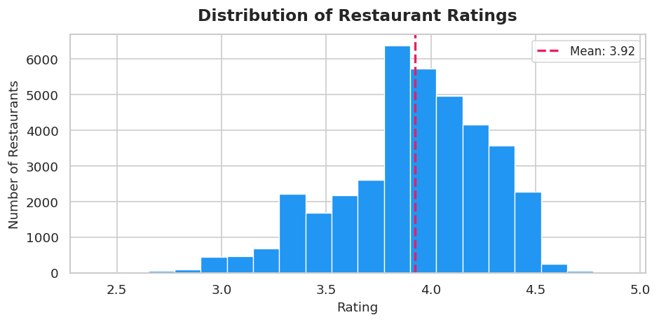

### 02 — Top 10 Cities by Restaurant Count
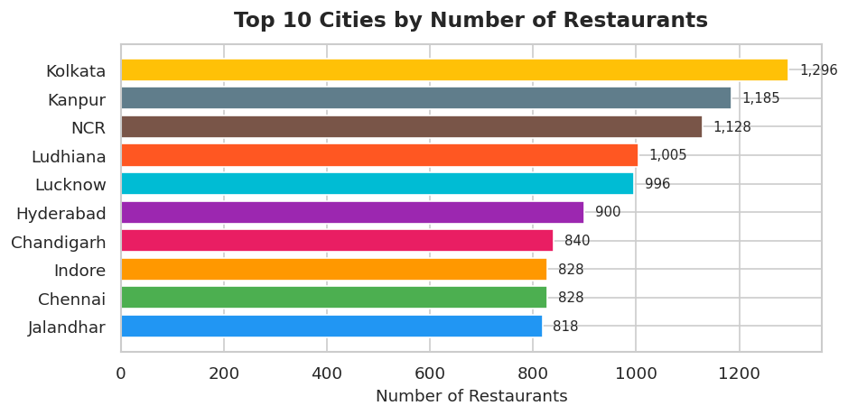

### 03 — Top 10 Primary Cuisines
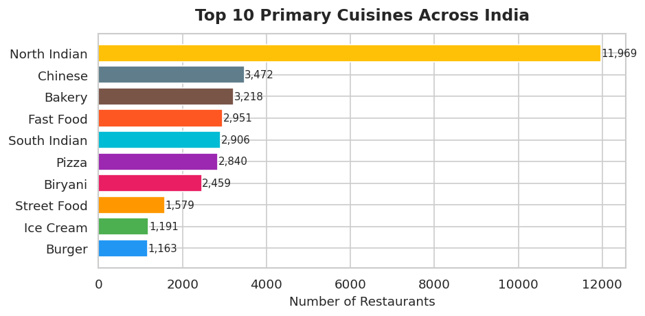

### 04 — Rating Category Breakdown
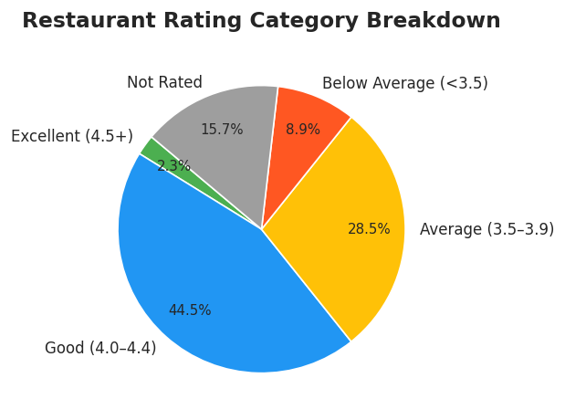

### 05 — Price Band Distribution
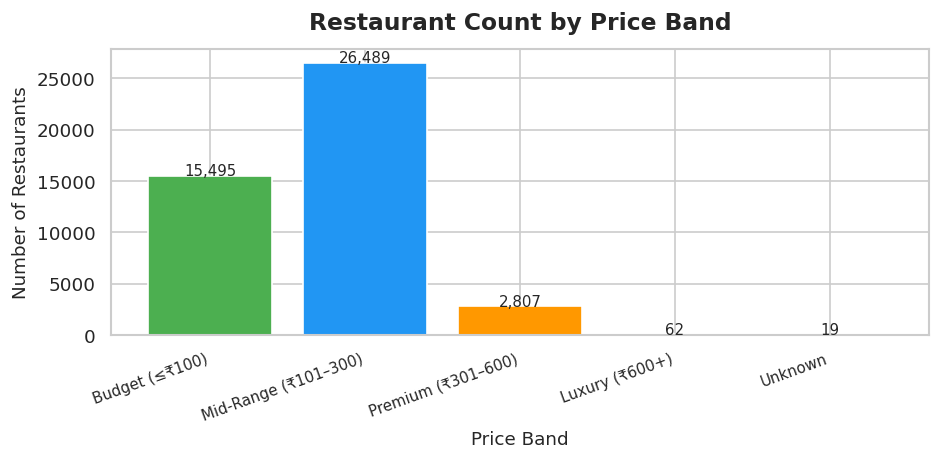

### 06 — Delivery Time Distribution
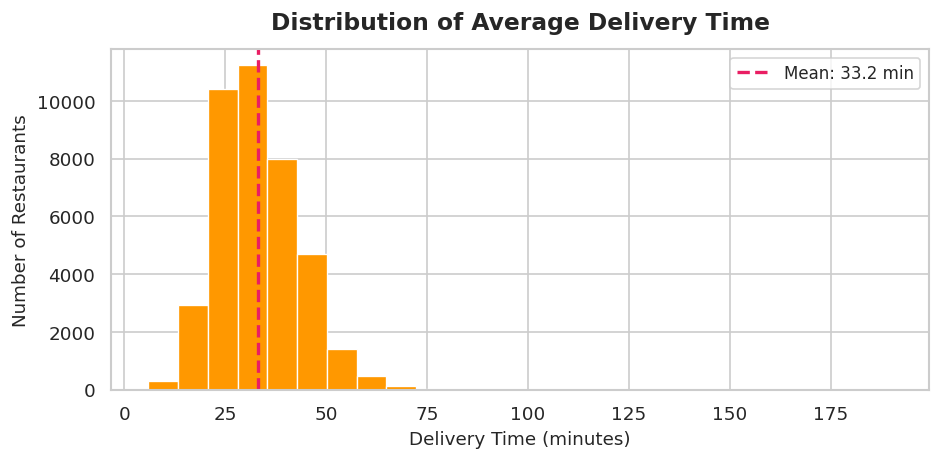

### 07 — Average Rating by City
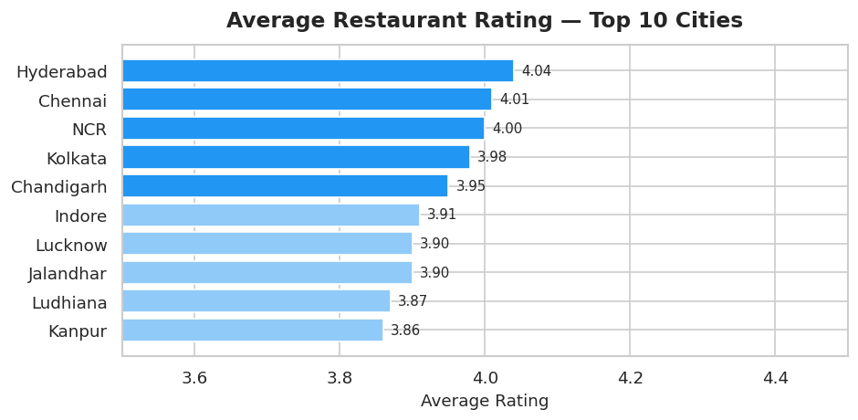

### 08 — Safety Compliance Distribution
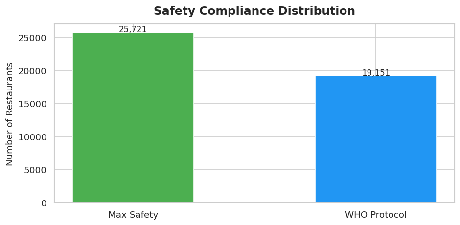

### 09 — Rating vs Price
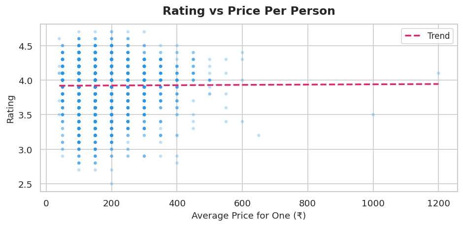

### 10 — Delivery Speed Distribution
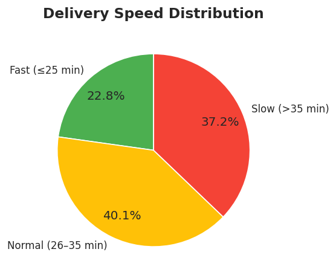

### 11 — Cuisine Diversity by City
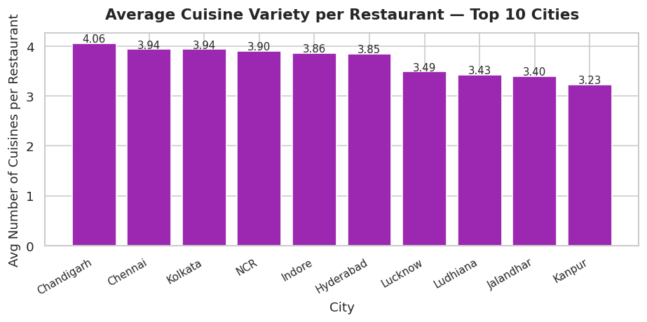

### 12 — Price Band vs Average Rating
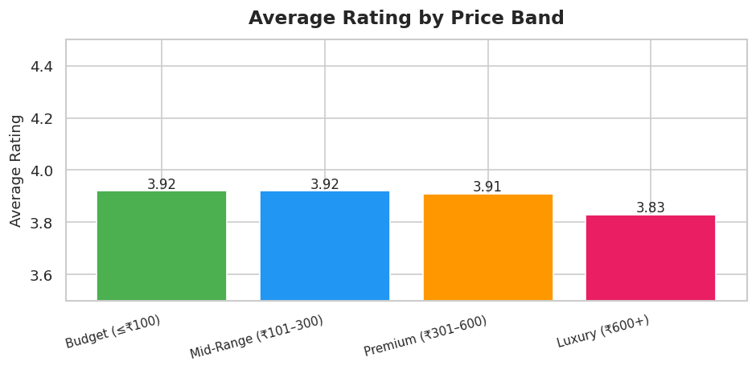

---

## 🔍  Key Business Insights

- 📊 **59%** of restaurants operate in the mid-price segment (₹101–300)
- 🚀 Only **20%** of restaurants deliver within 25 minutes
- ⭐ Only **2.3%** of restaurants achieve Excellent ratings (4.5+)
- 🍛 **North Indian** is the dominant cuisine — 26.7% of all restaurants
- 💰 Price has **near-zero correlation** with customer ratings
- 🏙️ **Hyderabad & Chennai** lead in average restaurant quality
- 🌆 Tier-2 cities like **Kanpur & Ludhiana** have surprisingly high
  restaurant counts compared to many metros

---

## 📝 Note

This repository showcases the source notebook, project methodology, business findings, 
and visual outputs. The raw dataset is intentionally excluded from the public repository. 
Cell outputs were cleared before upload to keep the repository lightweight; all visualizations 
and key findings are available in the README and plots folder. Project walkthroughs and 
technical discussions are available upon request.

---

## 👤 Author

**Victor Sarmacharjee**   
Aspiring Data Analyst

[LinkedIn](https://www.linkedin.com/in/victorsa09/)
